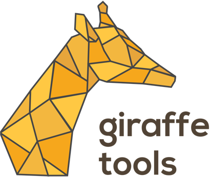

[](https://www.codacy.com/app/TimVanMourik/GiraffeTools?utm_source=github.com&amp;utm_medium=referral&amp;utm_content=GiraffeTools/GiraffeTools&amp;utm_campaign=Badge_Grade)
[](https://travis-ci.org/TimVanMourik/GiraffeTools)
[](https://codecov.io/gh/TimVanMourik/GiraffeTools)


Website: https://giraffe.tools
# Giraffe Tools 


### GiraffeTools
**Tools** for **G**raphical **I**nterface for **R**eproducible **A**nalysis o**F** work**F**low **E**xperiments

GiraffeTools provides tools for interactive workflow development Currently the main tool is the [Porcupine](https://doi.org/10.1371/journal.pcbi.1006064) workflow editor. You can visually build a node graph that represents a workflow and read and write it from and to GitHub.


*Note: this software was originally made for neuroimaging pipeline analysis, but is now expanding to different toolboxes*

## Intended usage
Set up any GitHub repository as a GiraffeTools project by putting a **Giraffe.yml** file in the root of the project. GiraffeTools reads information straight from an analysis repository, just go to:
https://giraffe.tools/github/ **[username]** / **[repository]** / **[branch]**
to find a dashboard of the project. A **Giraffe.yml** looks like this:
```
# list of tools
tools:
  porcupine:
    # A file in your repository to which the UI state is saved
    # Currently only a single file is supported
    files:
      - GIRAFFE/keras.pork
    # A list of nodes to load into the editor
    # The path is either relative to the root or a full URL
    nodes:
      - https://raw.githubusercontent.com/TimVanMourik/keras/giraffe-tools/keras_nodes.json
    # You can load your own JavaScript code generator. Documentation will follow soon
    # The path is either relative to the root or a full URL
    grammars:
      - language: TvM
        script: GIRAFFE/test.js
        format: matlab
```
Example: https://giraffe.tools/github/TimVanMourik/SomeGiraffeExample/master

## Development
Download this repository *with submodules*, such that the code from linked repositories are included:
```
git clone https://github.com/GiraffeTools/GiraffeTools --recursive
```
or
```
git clone https://github.com/GiraffeTools/GiraffeTools
git submodule update --init
```
The website can locally be deployed with [Docker](https://www.docker.com) and `docker-compose`. Starting local development is as easy as typing in the command line:
```
docker-compose up
```
If you want to customise your settings, specify this in a `.env` file in the root of the project. You can start by renaming the `env.sample`.

You can run the site in three different modes, MODE=watch|development|production. Default is `watch`. This automatically enables *hot reloading* and updates your browser pages upon saving a source file. In development mode, you can still use debug statement, but there is no 'hot reloading'. The production mode is the way it's gonna be like online.

## Slack
Developers and users alike, join us on [Slack](https://giraffe.tools/slack)!


## Contributing
Any contributions are much appreciated! In the form of issues about bugs, feature requests, enhancement ideas, or even pull requests! If you like more details, you can find them in CONTRIBUTING.md.
